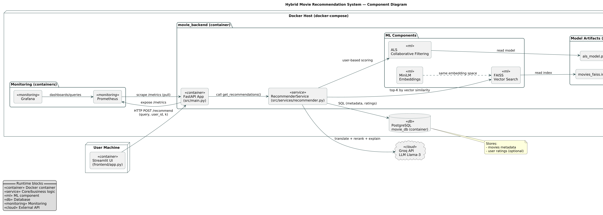
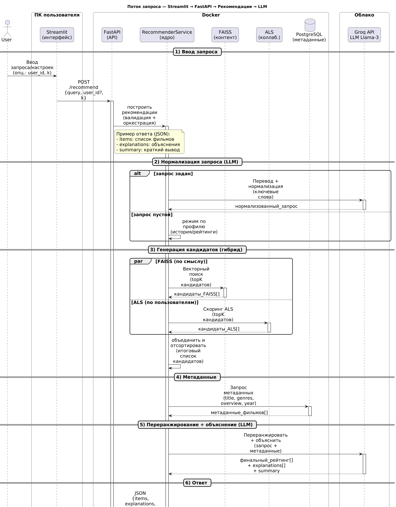

# Hybrid Movie Recommendation System

Гибридная рекомендательная система фильмов, построенная на микросервисной архитектуре. Проект объединяет классические алгоритмы машинного обучения (ALS, FAISS) с возможностями LLM (Llama-3) для интерпретации запросов и объяснения рекомендаций.

## Описание проекта

Система предоставляет персонализированные рекомендации фильмов, используя гибридный подход:
1.  **Контентная фильтрация (Content-Based):** Векторный поиск по семантике описаний фильмов через FAISS (эмбеддинги MiniLM).
2.  **Коллаборативная фильтрация (Collaborative Filtering):** Матричная факторизация ALS для учета истории действий похожих пользователей.
3.  **LLM-обогащение:** Использование большой языковой модели (Llama-3 через Groq API) для перевода запросов с русского языка, извлечения ключевых слов и генерации текстовых объяснений, почему именно этот фильм подходит пользователю.

## Архитектура системы

Ниже представлена диаграмма компонентов, демонстрирующая взаимодействие сервисов, баз данных и внешних API.



## Логика обработки запроса

Путь пользовательского запроса от интерфейса до получения ответа с объяснениями.



## Основные возможности

*   **Мультиязычный поиск:** Возможность вводить запросы на русском языке (автоматический перевод через LLM).
*   **Гибридный ранжирование:** Объединение результатов FAISS (схожесть векторов) и ALS (индивидуальные предпочтения) с настраиваемыми весами.
*   **Объясняемость (Explainability):** LLM анализирует список рекомендованных фильмов и генерирует краткое пояснение, почему фильм подходит под запрос пользователя.
*   **Мониторинг:** Сбор метрик производительности (Prometheus) и визуализация (Grafana).

## Стек технологий

*   **Язык:** Python 3.11
*   **Web Framework:** FastAPI, Streamlit
*   **ML & Data:** PyTorch (Sentence Transformers), FAISS, Implicit (ALS), Pandas, NumPy
*   **LLM:** Llama-3-8b via Groq API
*   **Database:** PostgreSQL
*   **DevOps:** Docker, Docker Compose
*   **Monitoring:** Prometheus, Grafana, MLflow

## Структура проекта

```text
recsys_project/
├── data/                   # Исходные и обработанные датасеты
├── docs/uml/               # Исходники UML-диаграмм (.puml)
├── frontend/               # Клиентское приложение (Streamlit)
├── scripts/                # Скрипты миграции данных и утилиты
├── src/                    # Исходный код бэкенда
│   ├── api/                # Маршруты и схемы FastAPI
│   ├── database/           # Модели и подключение к БД
│   ├── services/           # Бизнес-логика (ML, LLM)
│   ├── config.py           # Конфигурация приложения
│   └── main.py             # Точка входа
├── docker-compose.yml      # Оркестрация контейнеров
└── requirements.txt        # Зависимости Python
```

## Установка и запуск

### Предварительные требования
*   Docker и Docker Compose
*   Аккаунт Groq API (для получения API Key)

### Инструкция по запуску

1.  **Настройка окружения**
    Создайте файл `.env` в корне проекта на основе примера.
    ```bash
    POSTGRES_USER=myuser
    POSTGRES_PASSWORD=mypassword
    POSTGRES_DB=movie_recsys
    GROQ_API_KEY=your_groq_api_key_here
    ```

2.  **Запуск контейнеров**
    Соберите и запустите сервисы в фоновом режиме.
    ```bash
    docker-compose up -d --build
    ```

3.  **Миграция данных**
    Загрузите данные из CSV в базу данных PostgreSQL. (Выполняется единоразово)
    ```bash
    docker exec movie_backend python scripts/migrate_csv_to_sql.py
    ```

4.  **Доступ к интерфейсам**
    *   **Backend API (Swagger UI):** http://localhost:8000/docs
    *   **Frontend (Streamlit):** http://localhost:8501
    *   **Grafana:** http://localhost:3000
    *   **Prometheus:** http://localhost:9090

## Разработка

Для локальной разработки без Docker установите зависимости:
```bash
python -m venv .venv
source .venv/bin/activate  # или .venv\Scripts\activate на Windows
pip install -r requirements.txt
uvicorn src.main:app --reload
```
